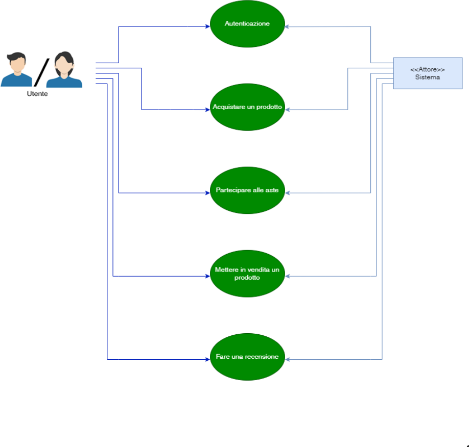
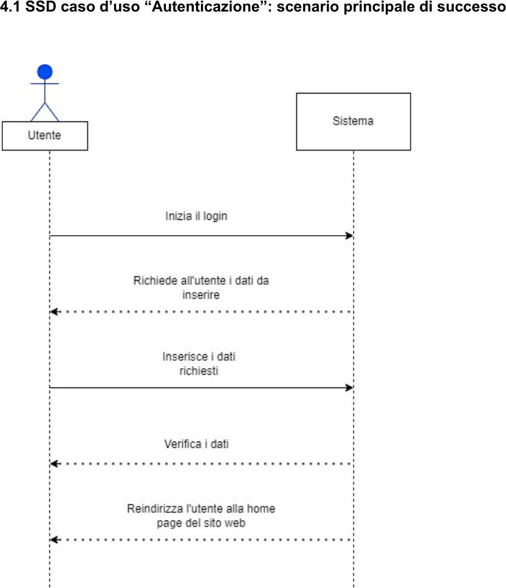
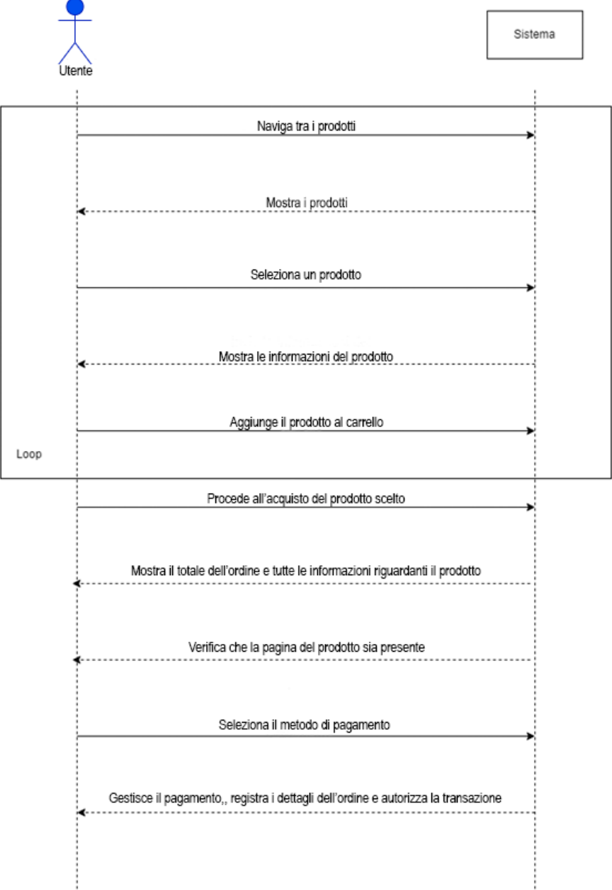
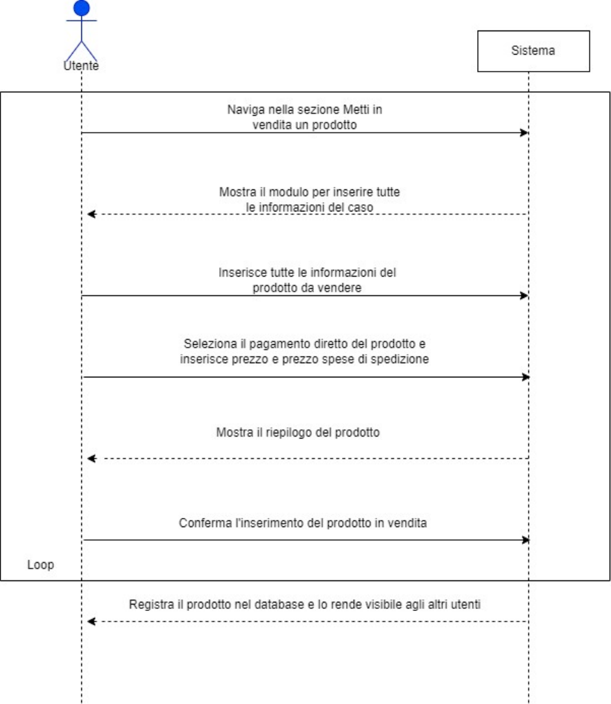
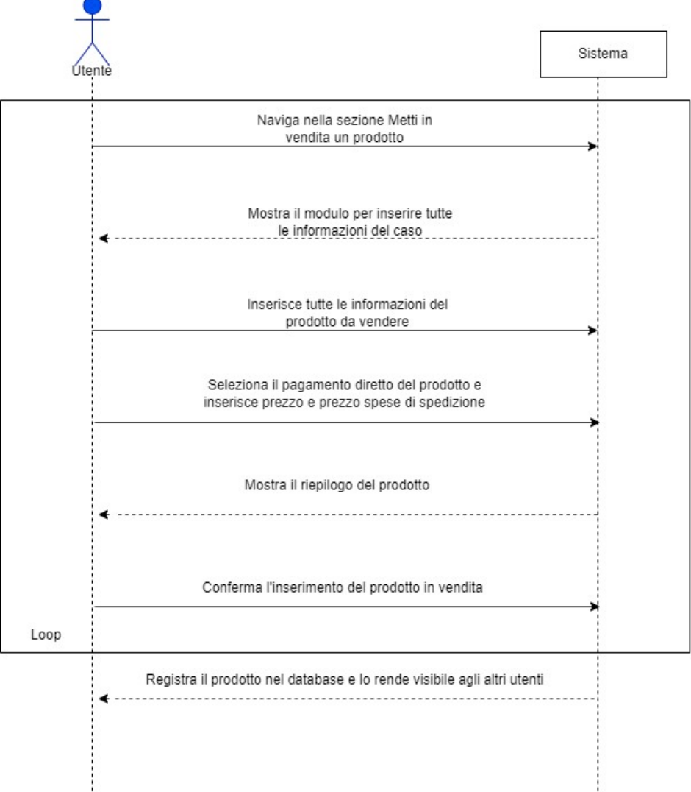
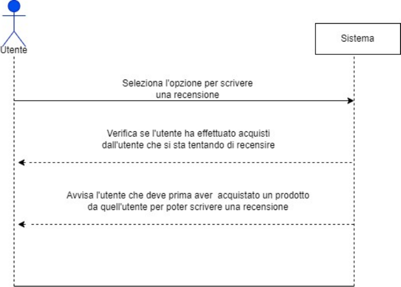
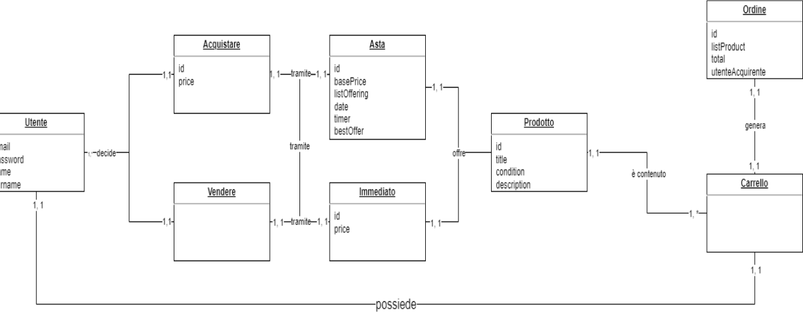
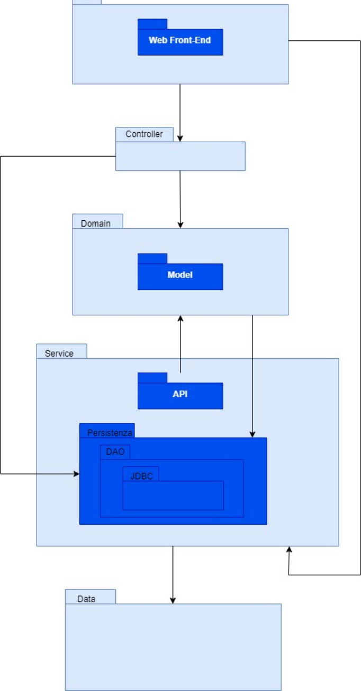

# 🎮 Nerd Warehouse

**Alessio Carlo — 223486**

Piattaforma web dedicata agli appassionati di fumetti e videogiochi per l'acquisto e la vendita di prodotti usati, tramite pagamento immediato o aste a tempo.

---

## Indice

1. [Requisiti Utente](#1-requisiti-utente)
   - [1.1 Descrizione generale](#11-descrizione-generale)
   - [1.2 Requisiti funzionali](#12-requisiti-funzionali)
   - [1.3 Requisiti non funzionali](#13-requisiti-non-funzionali)
2. [Diagramma dei Casi d'Uso](#2-diagramma-dei-casi-duso)
3. [Casi d'Uso](#3-casi-duso)
   - [3.1 Autenticazione](#31-autenticazione)
   - [3.2 Acquistare un prodotto](#32-acquistare-un-prodotto)
   - [3.3 Partecipare alle aste](#33-partecipare-alle-aste)
   - [3.4 Mettere in vendita un prodotto](#34-mettere-in-vendita-un-prodotto)
   - [3.5 Fare una recensione](#35-fare-una-recensione)
4. [SSD di Sistema](#4-ssd-di-sistema)
5. [Contratti delle Operazioni](#5-contratti-delle-operazioni)
6. [Modello di Dominio](#6-modello-di-dominio)
7. [Architettura di Sistema](#7-architettura-di-sistema)

---

## 1. Requisiti Utente

### 1.1 Descrizione generale

La piattaforma è stata progettata per fornire agli appassionati di fumetti e videogiochi uno spazio virtuale dedicato all'acquisto e alla vendita di prodotti usati. L'obiettivo principale è agevolare gli utenti interessati a dare una nuova vita ai propri fumetti o videogiochi già posseduti, consentendo loro di guadagnare vendendoli ad altri appassionati o di ampliare la propria collezione acquistando a prezzi convenienti.

### 1.2 Requisiti funzionali

**Registrazione Utente**
- Gli utenti possono creare un account.
- Le credenziali di accesso (e-mail e password) vengono utilizzate per accedere all'area personale.

**Gestione del Profilo Utente**
- Gli utenti possono modificare le informazioni del proprio profilo, inclusi dettagli personali e indirizzo di spedizione.

**Inserimento Prodotti**
- Gli utenti possono inserire i propri fumetti o videogiochi usati specificando titolo, autore (nel caso dei fumetti), piattaforma (nel caso dei videogiochi), condizioni del prodotto, prezzo desiderato e prezzo per le spese di spedizione.
- È possibile allegare immagini del prodotto.

**Ricerca**
- Gli utenti possono cercare prodotti specifici utilizzando filtri come categoria, condizione, titolo.

**Metodi di Acquisto**
- *Aste a Tempo*: gli utenti possono partecipare ad aste con durata definita per aggiudicarsi il prodotto.
- *Pagamenti Digitali Immediati*: gli utenti possono acquistare immediatamente i prodotti senza partecipare ad aste a tempo.

**Recensioni**
- Dopo ogni transazione, gli acquirenti e i venditori possono lasciare un feedback e una valutazione.

### 1.3 Requisiti non funzionali

**Sicurezza**
- Implementare misure di sicurezza per proteggere le informazioni degli utenti, inclusi dati personali e informazioni di pagamento.

**Prestazioni**
- Progettare la piattaforma per un'esperienza utente ottimale, garantendo ottime prestazioni e tempi di risposta rapidi.

**Usabilità**
- Realizzare un'interfaccia intuitiva e di facile utilizzo per massimizzare l'usabilità della piattaforma, facilitando la navigazione e migliorando l'esperienza complessiva degli utenti.

---

## 2. Diagramma dei Casi d'Uso

Nel diagramma dei casi d'uso sono presenti due attori principali:

**➢ Utente**
- Può registrarsi nel sistema.
- Può effettuare l'accesso al sistema inserendo le credenziali inserite in fase di registrazione.
- Può ricercare un prodotto.
- Può acquistare uno o più prodotti.
- Può inserire un prodotto per la vendita.
- Può partecipare e fare offerte alle aste.
- Può modificare il prodotto in vendita.
- Può verificare gli ordini dei suoi prodotti effettuati da altri utenti e procedere alla spedizione.
- Può aggiungere, modificare, eliminare una recensione all'utente dalla quale ha acquistato un prodotto.
- Può verificare le recensioni che gli altri utenti hanno effettuato dopo aver acquistato un suo prodotto.

**➢ Sistema**
- Elabora le richieste.

---

## 3. Casi d'Uso

### 3.1 Autenticazione

| | |
|---|---|
| **Portata** | Sito web |
| **Livello** | Obiettivo Utente |
| **Attore Primario** | Utente |

**Parti interessate e interessi:**
- *Utente*: vuole accedere in modo sicuro, veloce e semplice al proprio account.
- *Sistema*: vuole portare a termine la registrazione di un utente con successo per permettergli di accedere ai servizi della piattaforma.

**Pre-condizioni:** Nessuna

**Post-condizioni:** L'utente può accedere al suo profilo personale e quindi iniziare ad usare tutte le funzionalità del sistema relative alla sua area riservata. Il sistema ha correttamente registrato tutti i dati inseriti durante la procedura di autenticazione.

**Scenario principale di successo (Flusso Base):**
1. L'utente accede alla pagina di registrazione.
2. Il sistema richiede all'utente username, e-mail e password.
3. L'utente inserisce i dati richiesti.
4. Il sistema controlla i dati inseriti dall'utente.
5. Il sistema comunica all'utente che si è registrato correttamente.
6. L'utente effettua il login inserendo e-mail e password.
7. Il sistema verifica che i dati inseriti dall'utente corrispondano.
8. L'utente ora può accedere alla propria area riservata.
9. Il caso d'uso termina.

**Estensioni (Flussi Alternativi):**

- **\*a** In qualsiasi momento l'utente decide di interrompere la procedura di autenticazione chiudendo l'applicazione:
  1. Il caso d'uso termina, quindi si ritorna al punto 9 del flusso principale.
- **\*b** In qualsiasi momento, può mancare la connessione Internet:
  1. Il sistema informa l'utente e lo invita a controllare la connessione, poi a riprovare.
- **\*c** In qualsiasi momento, può verificarsi un errore interno al sistema:
  1. Il sistema informa l'utente e lo invita a riprovare.
- **1a.** L'utente si è già registrato in precedenza e decide di effettuare il login invece della registrazione:
  1. L'utente continua dal punto 6 del flusso principale.
- **1b.** L'utente decide di avviare il recupero della password:
  1. Il sistema richiede all'utente di inserire l'e-mail associata al proprio account.
  2. L'ospite inserisce l'e-mail e conferma.
     - **2a.** Nel caso in cui l'utente non inserisca l'e-mail e confermi:
       1. Il sistema informa l'utente che inserire l'e-mail è obbligatorio.
       2. Il processo ritorna al punto 1 del flusso alternativo 1b.
  3. Il sistema verifica l'esistenza di un account associato all'e-mail ricevuta.
     - **3a.** Il sistema non riconosce nessun account associato all'e-mail inserita:
       1. Il sistema informa l'utente.
       2. Il processo ritorna al punto 1 del flusso alternativo 1b.
  4. Il sistema invia la procedura di ripristino password all'e-mail inserita.
  5. L'utente avvia la procedura di ripristino password tramite l'e-mail ricevuta.
  6. L'utente inserisce la nuova password.
  7. Il sistema aggiorna la password.
  8. Si riprende dal punto 6 del flusso principale.
- **2a.** L'utente non ha un'e-mail:
  1. L'utente non può portare a termine la registrazione.
- **4a.** L'utente non ha inserito tutti i campi richiesti:
  1. Il sistema non permette la registrazione e avvisa l'utente.
  2. L'utente inserisce i campi mancanti non ancora inseriti.
- **4b.** I dati inseriti dall'utente superano la lunghezza imposta dal sistema e/o password non valida:
  1. Il sistema non permette la registrazione e avvisa l'utente.
  2. L'utente inserisce dati e/o password diversi.
- **4c.** L'e-mail è stata già usata:
  1. Il sistema non permette la registrazione e avvisa l'utente.
  2. L'utente continua dal punto 6 del flusso principale.
- **7a.** Il sistema non riconosce le credenziali inserite:
  1. Il sistema informa l'utente che i dati inseriti non corrispondono a quelli registrati.
  2. Si riprende dal punto 6 del flusso principale.

### 3.2 Acquistare un prodotto

| | |
|---|---|
| **Portata** | Sito web |
| **Livello** | Obiettivo Utente |
| **Attore Primario** | Utente |

**Parti interessate e interessi:**
- *Utente*: vuole acquistare un prodotto tramite pagamento immediato.
- *Sistema*: vuole gestire l'acquisto e salvare i dati dell'ordine.
- *Utente venditore*: vuole ricevere le informazioni per spedire il prodotto.

**Pre-condizioni:** Essere autenticati.

**Post-condizioni:** L'utente ha completato con successo l'acquisto, il sistema ha registrato l'ordine, l'utente venditore è stato informato dell'ordine e ha ricevuto i dati per inviare il prodotto.

**Scenario principale di successo (Flusso Base):**
1. L'utente accede alla propria area autenticata nel sistema.
2. L'utente naviga tra i prodotti disponibili e seleziona un prodotto che può acquistare immediatamente senza asta.
3. Il sistema mostra la descrizione, le immagini, il prezzo, il prezzo delle spese di spedizione e la condizione del prodotto.
4. L'utente aggiunge il prodotto al carrello.
5. L'utente visualizza i prodotti nel carrello e può decidere se procedere con l'acquisto o apportare modifiche al carrello.
6. L'utente procede all'acquisto del prodotto.
7. L'utente seleziona il metodo di pagamento desiderato e fornisce i dettagli necessari.
8. Il sistema gestisce il pagamento, registra i dettagli dell'ordine e autorizza la transazione.
9. Il sistema conferma all'utente che l'acquisto è stato effettuato con successo.
10. L'utente riceve una conferma dell'ordine via e-mail.
11. Il sistema rimuove la pagina del prodotto.
12. Il sistema informa l'utente venditore che il suo prodotto è stato venduto ad un altro utente e che può procedere alla spedizione previo ricevimento del pagamento.

**Estensioni (Flussi Alternativi):**

- **\*a** L'utente può decidere di interrompere l'acquisto fino al punto 7 del flusso, dopo di che non è più possibile interrompere, poiché la pagina del prodotto verrà eliminata. In questo caso, l'utente venditore dovrà prendere una decisione su eventuali rimborsi all'utente acquirente e sul reinserimento del prodotto in vendita.
- **\*b** In qualsiasi momento, può mancare la connessione Internet:
  1. Il sistema informa l'utente e lo invita a controllare la connessione, poi a riprovare.
- **\*c** In qualsiasi momento, può verificarsi un errore interno al sistema:
  1. Il sistema informa l'utente e lo invita a riprovare.
- **2a.** L'utente sceglie di acquistare un articolo all'asta:
  1. Osservare il flusso "Partecipare alle aste" al paragrafo successivo.
- **4a.** L'utente ha già un prodotto nel carrello e decide di aggiungere un altro prodotto durante lo stesso processo di acquisto:
  1. Nel carrello ci saranno ordini separati per ogni prodotto, l'utente dovrà scegliere quale prodotto pagare.
     - **1a.** L'utente elimina un prodotto dal carrello:
       1. Il carrello si aggiorna con i prodotti da acquistare.
       2. L'utente verrà reindirizzato al punto 5 del flusso.
  2. Sceglie di pagare il prodotto meno recente messo nel carrello.
     - **2a.** Sceglie di pagare l'ultimo prodotto aggiunto:
       1. L'utente verrà reindirizzato al punto 7 del flusso.
  3. Il sistema verifica se la pagina del prodotto esiste.
     - **3a.** Se la pagina del prodotto non esiste più:
       1. Il sistema elimina il prodotto dal carrello.
       2. Il sistema avvisa l'utente.
       3. L'utente ritorna al punto 5 del flusso.
  4. L'utente riprende dal punto 7 del flusso.
- **7a.** Prodotto non disponibile:
  1. Il sistema verifica che il prodotto scelto non è più disponibile.
  2. Il sistema elimina il prodotto dal carrello.
  3. L'utente ritorna al punto 5 del flusso.
- **8a.** Carta di credito scaduta:
  1. Il sistema non permette il pagamento e avvisa l'utente.
  2. L'utente ritorna al punto 7 del flusso.
- **8b.** Saldo insufficiente su carta:
  1. Il sistema non permette il pagamento e avvisa l'utente.
  2. L'utente ritorna al punto 7 del flusso.
- **8c.** Il sistema non riesce a confermare il pagamento:
  1. Il sistema non riesce a confermare il pagamento a causa di problemi tecnici o di connessione.
  2. L'utente ritorna al punto 7 del flusso.

### 3.3 Partecipare alle aste

| | |
|---|---|
| **Portata** | Sito web |
| **Livello** | Obiettivo Utente |
| **Attore Primario** | Utente |

**Parti interessate e interessi:**
- *Utente*: vuole partecipare ad un'asta per aggiudicarsi il prodotto.
- *Sistema*: vuole gestire il corretto svolgimento delle aste, raccogliere le offerte degli utenti e assegnare il prodotto al miglior offerente.
- *Utente venditore*: vuole ricevere le informazioni per spedire il prodotto.

**Pre-condizioni:** L'utente è autenticato nel sistema.

**Post-condizioni:** L'utente ha partecipato con successo all'asta, il sistema ha registrato l'offerta dell'utente; se l'utente risulta il miglior offerente al termine dell'asta, il sistema assegna il prodotto all'utente. L'utente venditore è stato informato dell'ordine e ha ricevuto i dati per inviare il prodotto al vincitore dell'asta.

**Scenario principale di successo (Flusso Base):**
1. L'utente accede alla propria area autenticata nel sistema.
2. L'utente naviga tra i prodotti disponibili e seleziona un prodotto acquistabile tramite asta.
3. Il sistema mostra la descrizione, le immagini, il prezzo attuale, il prezzo delle spese di spedizione, la condizione del prodotto e la durata dell'asta.
4. L'utente inserisce la propria offerta che supera il prezzo attuale.
5. Il sistema registra l'offerta dell'utente e aggiorna l'offerta corrente.
6. Il sistema non notifica all'utente che la sua offerta è stata superata poiché la sua offerta è la più alta.
7. L'asta raggiunge la sua scadenza.
8. Il sistema determina l'utente come miglior offerente e assegna il prodotto a quest'ultimo, inserendo il prodotto nel suo carrello e avvia un timer che determina la scadenza del pagamento.
9. Il sistema informa l'utente che si è aggiudicato il prodotto e che deve procedere con il pagamento entro un determinato periodo di tempo.
10. Il sistema informa l'Utente venditore che l'asta è finita con tutte le informazioni.
11. L'utente procede con il pagamento del prodotto nell'area carrello.

**Estensioni (Flussi Alternativi):**

- **\*a** L'utente decide di ritirarsi prima della scadenza dell'asta:
  1. L'utente ritira la propria offerta.
  2. Il sistema annulla la sua partecipazione all'asta.
  3. L'utente può scegliere di inserire un'offerta in un momento successivo.
- **\*b** In qualsiasi momento, può mancare la connessione Internet:
  1. Il sistema informa l'utente e lo invita a controllare la connessione, poi a riprovare.
- **\*c** In qualsiasi momento, può verificarsi un errore interno al sistema:
  1. Il sistema informa l'utente e lo invita a riprovare.
- **7a.** L'offerta dell'utente è stata superata:
  1. Il sistema notifica all'utente che la sua offerta è stata superata.
  2. L'utente decide di aumentare la sua offerta.
     - **2a.** L'utente decide di ritirarsi dall'asta, non aumenta l'offerta.
  3. L'utente riprende dal punto 4 del flusso.
- **11a.** Il timer che determina la scadenza del pagamento è scaduto:
  1. Il sistema notifica l'utente che non è più possibile pagare il prodotto.
  2. Il sistema notifica l'utente con la seconda offerta più alta.
  3. L'utente con la seconda offerta più alta decide di acquistare il prodotto.
     - **3a.** L'utente con la seconda offerta più alta decide di non acquistare:
       1. Il sistema informa l'utente venditore che l'asta è annullata.
     - **3b.** L'utente fa scadere il timer della scadenza del pagamento:
       1. Il sistema informa l'utente venditore che l'asta è annullata.

### 3.4 Mettere in vendita un prodotto

| | |
|---|---|
| **Portata** | Sito web |
| **Livello** | Obiettivo Utente |
| **Attore Primario** | Utente |

**Parti interessate e interessi:**
- *Utente*: vuole mettere in vendita un prodotto.
- *Sistema*: vuole gestire il processo di inserimento del prodotto in vendita e fornire opzioni per la vendita diretta o tramite asta.

**Pre-condizioni:** L'utente è autenticato nel sistema.

**Post-condizioni:** Il prodotto è stato correttamente inserito nel sistema, l'utente può monitorare lo stato della vendita nella sua area personale.

**Scenario principale di successo (Flusso Base):**
1. L'utente accede alla propria area autenticata nel sistema.
2. L'utente naviga verso la sezione "Metti in vendita un prodotto".
3. L'utente inserisce i dettagli del prodotto da vendere, inclusi titolo, descrizione, immagini, condizioni del prodotto.
4. L'utente seleziona l'opzione di vendita come pagamento diretto e inserisce prezzo e prezzo spese di spedizione.
5. Il sistema mostra il riepilogo del prodotto.
6. L'utente conferma l'inserimento del prodotto in vendita.
7. Il sistema registra il prodotto nel database e lo rende visibile agli altri utenti.
8. L'utente può visualizzare lo stato delle sue vendite nell'area personale.

**Estensioni (Flussi Alternativi):**

- **\*a** L'utente può ritirare il prodotto dalla vendita:
  1. Il sistema elimina la pagina del prodotto.
  2. Il sistema notificherà in caso di asta a tutti gli offerenti che l'asta è stata annullata.
- **\*b** In qualsiasi momento, può verificarsi un errore interno al sistema:
  1. Il sistema informa l'utente e lo invita a riprovare.
- **\*c** Se l'applicazione viene chiusa per una qualsiasi ragione prima del punto 6 del flusso, il caso d'uso termina e con esso anche l'inserimento del prodotto.
- **\*d** L'utente può modificare le informazioni del prodotto.
- **\*e** L'utente con l'offerta più alta al termine dell'asta può non pagare il prodotto:
  1. L'utente venditore può segnalare l'utente per cattiva condotta.
- **3a.** L'utente non ha inserito tutti i campi richiesti:
  1. Il sistema non permette la registrazione del prodotto e avvisa l'utente.
  2. L'utente inserisce i campi mancanti non ancora inseriti.
- **4a.** L'utente decide di optare per una vendita tramite asta:
  1. L'utente specifica la durata dell'asta, il prezzo iniziale e il prezzo delle spese di spedizione.
  2. Il sistema registra il prodotto come parte di un'asta in corso.
  3. L'utente riprende dal punto 6.
- **6a.** L'utente non conferma l'inserimento del prodotto:
  1. Il caso d'uso termina e con esso anche l'inserimento del prodotto.

### 3.5 Fare una recensione

| | |
|---|---|
| **Portata** | Sito web |
| **Livello** | Obiettivo Utente |
| **Attore Primario** | Utente |

**Parti interessate e interessi:**
- *Utente*: vuole pubblicare una recensione verso un utente dalla quale ha acquistato.
- *Sistema*: vuole salvare i dati inseriti e verificare se l'utente ha acquistato un prodotto dall'utente recensito.

**Pre-condizioni:** L'utente è autenticato nel sistema e l'utente ha completato almeno un acquisto.

**Post-condizioni:** La recensione è stata correttamente inserita nel sistema e può essere visualizzata dagli altri utenti.

**Scenario principale di successo (Flusso Base):**
1. L'utente accede alla propria area autenticata nel sistema.
2. L'utente naviga nella sezione di un altro utente.
3. L'utente decide di scrivere una recensione.
4. L'utente seleziona l'opzione per scrivere una recensione ad un altro utente.
5. Il sistema verifica se l'utente ha già effettuato acquisti da parte dell'utente che desidera recensire.
6. Il sistema verifica che ha acquistato dall'utente e visualizza un modulo per inserire la recensione.
7. L'utente inserisce il testo della recensione, assegna una valutazione (da 1 a 5 stelle) e fornisce eventuali dettagli aggiuntivi.
8. Il sistema verifica che tutti i campi siano stati compilati in modo completo e corretto.
9. Il sistema registra la recensione nel database associandola all'utente venditore.
10. Il sistema conferma all'utente che la recensione è stata registrata con successo.
11. La recensione è ora visibile agli altri utenti.

**Estensioni (Flussi Alternativi):**

- **\*a** Se l'applicazione viene chiusa per una qualsiasi ragione, il caso d'uso termina senza nessuna aggiunta della recensione.
- **\*b** In qualsiasi momento, può mancare la connessione Internet:
  1. Il sistema informa l'utente e lo invita a controllare la connessione, poi a riprovare.
- **\*c** In qualsiasi momento, può verificarsi un errore interno al sistema:
  1. Il sistema informa l'utente e lo invita a riprovare.
- **5a.** L'utente non ha acquistato un prodotto da quell'utente:
  1. Il sistema avvisa l'utente che deve prima aver acquistato un prodotto da quell'utente per poter scrivere una recensione.
  2. Il flusso termina.
- **7a.** L'utente non ha inserito tutti i campi richiesti:
  1. Il sistema non permette l'invio del modulo per aggiungere la recensione e avvisa l'utente.
  2. L'utente inserisce i campi mancanti non ancora inseriti.

---

## 4. SSD di Sistema

### 4.1 SSD caso d'uso "Autenticazione": scenario principale di successo

### 4.2 SSD caso d'uso "Acquistare un prodotto": scenario principale di successo

### 4.3 SSD caso d'uso "Partecipare alle aste": scenario principale di successo

### 4.4 SSD caso d'uso "Mettere in vendita un prodotto": scenario principale di successo

### 4.5 SSD caso d'uso "Fare una recensione": estensione 5a

---

## 5. Contratti delle Operazioni

### 5.1 Contratto CO1: `registrazioneUtente(username, email, password)`

| | |
|---|---|
| **Operazione** | `registrazioneUtente(username, email, password)` |
| **Riferimenti** | Caso d'uso: Autenticazione |
| **Pre-Condizioni** | L'utente non è autenticato nel sistema. |

**Post-Condizioni:**
- Un nuovo utente è registrato nel sistema con i dati forniti.
- L'utente è ora autenticato e può accedere al proprio profilo.

### 5.2 Contratto CO2: `inserisciProdotto(titolo, autore, condizioni, prezzo, spese_spedizione, immagini)`

| | |
|---|---|
| **Operazione** | `inserisciProdotto(titolo, autore, condizioni, prezzo, spese_spedizione, immagini)` |
| **Riferimenti** | Caso d'uso: Mettere in vendita un prodotto |
| **Pre-Condizioni** | L'utente è autenticato nel sistema. |

**Post-Condizioni:**
- Un nuovo prodotto è inserito nel sistema con i dettagli forniti.
- Il prodotto è ora visibile agli altri utenti.

### 5.3 Contratto CO3: `partecipaAsta(titolo, offerta)`

| | |
|---|---|
| **Operazione** | `partecipaAsta(titolo, offerta)` |
| **Riferimenti** | Caso d'uso: Partecipare alle aste |
| **Pre-Condizioni** | L'utente è autenticato nel sistema e ha scelto un prodotto in asta. |

**Post-Condizioni:**
- L'offerta dell'utente è registrata per il prodotto in asta.
- L'utente sarà notificato se la sua offerta è superata da altri utenti.

### 5.4 Contratto CO4: `confermaAcquisto(titolo)`

| | |
|---|---|
| **Operazione** | `confermaAcquisto(titolo)` |
| **Riferimenti** | Caso d'uso: Acquistare un prodotto |
| **Pre-Condizioni** | L'utente è autenticato nel sistema e ha un prodotto nel carrello. |

**Post-Condizioni:**
- L'acquisto è confermato e il prodotto è segnato come venduto.
- L'utente venditore è informato dell'ordine e può procedere alla spedizione.

### 5.5 Contratto CO5: `scriviRecensione(utente_recensito, testo, valutazione)`

| | |
|---|---|
| **Operazione** | `scriviRecensione(utente_recensito, testo, valutazione)` |
| **Riferimenti** | Caso d'uso: Fare una recensione |
| **Pre-Condizioni** | L'utente è autenticato nel sistema e ha completato almeno un acquisto. |

**Post-Condizioni:**
- La recensione è registrata nel sistema e associata all'utente recensito.
- La recensione è ora visibile agli altri utenti.

---

## 6. Modello di Dominio

### 6.1 Descrizione Modello di Dominio

Ogni **Utente** può decidere di **Acquistare** o **Vendere** un prodotto; in entrambi i casi l'Utente può decidere se farlo tramite **Asta** o **Immediato**.

Sia Asta che Immediato offrono un **Prodotto** all'Utente, quest'ultimo può inserirlo nel **Carrello** per poi generare un **Ordine**.

---

## 7. Architettura di Sistema

### 7.1 Descrizione Architettura di Sistema

È un'architettura a strati, con una separazione tra l'interfaccia utente, la logica di business e l'accesso ai dati. Questa struttura modulare favorisce la manutenibilità e la scalabilità del sistema.

**UI (Interfaccia Utente):**
- Invia richieste al Controller per gestire le interazioni utente.
- Angular è utilizzato per gestire il lato client dell'applicazione web.

**Controller:**
- Riceve le richieste dall'UI e le invia al Domain e alla Persistenza, secondo la logica di business dell'applicazione.
- Funge da intermediario tra l'interfaccia utente e la logica di backend.

**Domain:**
- Contiene il Model, che rappresenta la logica di business dell'applicazione.
- Interagisce con la Persistenza per l'accesso ai dati.

**Persistenza:**
- Contiene DAO (Data Access Object) e JDBC (Java Database Connectivity), indicando la gestione dell'accesso e della manipolazione dei dati.
- Utilizzata dal Domain per accedere e persistere i dati nel database.

**Service:**
- Contiene API, che può fornire servizi o risorse al Controller e al Domain.
- Contiene la logica aziendale e fa riferimento ai dati tramite la Persistenza.

**Data:**
- Rappresenta il livello dati o il repository di dati per l'applicazione.
- È accessibile dal Service per ottenere e manipolare i dati.
